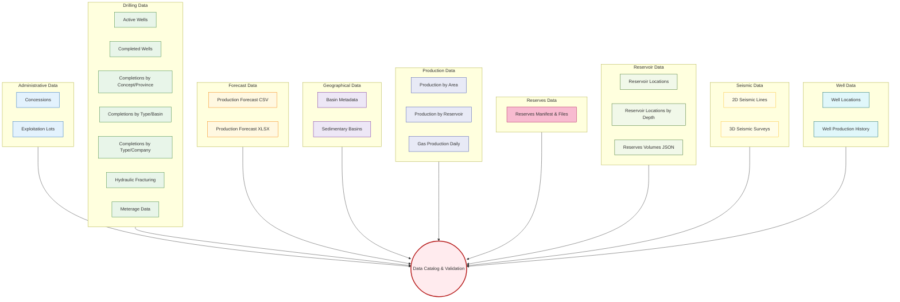
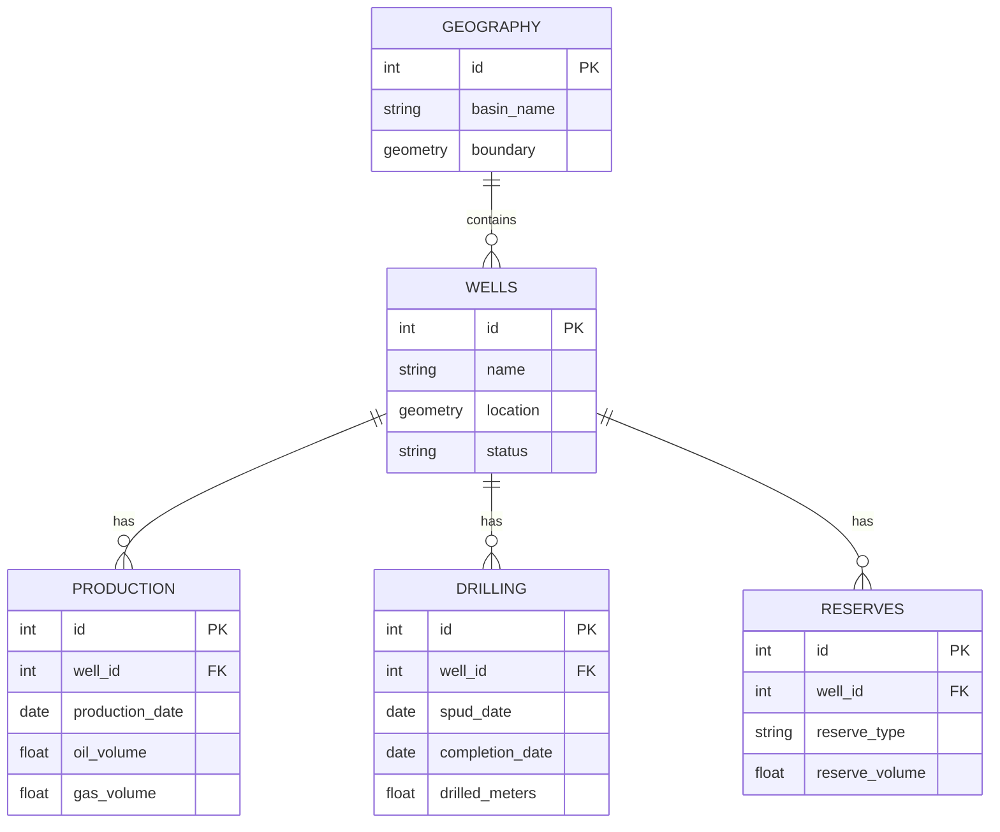
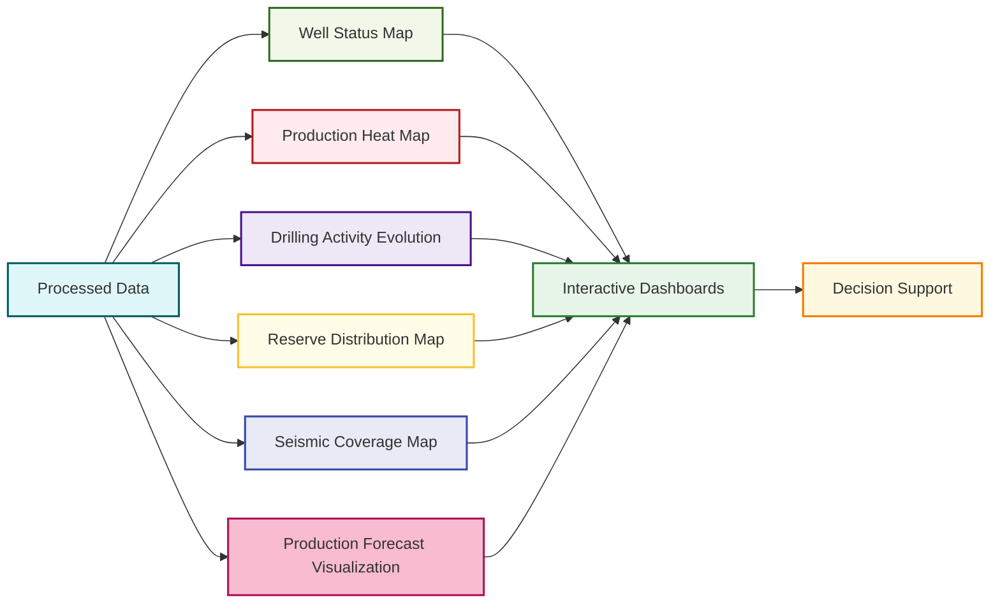
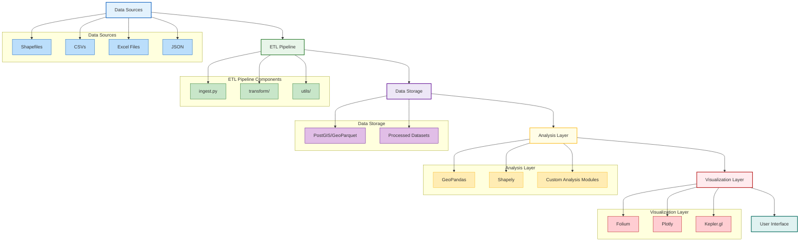

# ArgGIS Core Module

The ArgGIS core module is the engine behind our oilfield data processing and visualization system. It unifies disparate geospatial and operational datasets into a coherent model that powers mapping, analytics, and reporting workflows. This README details the module's architecture, process flows, unified data models, key capabilities, and visualization outputs.

---

## Overview

ArgGIS is built to ingest, transform, and visualize oilfield data. It streamlines the pipeline from raw data ingestion to interactive outputs, ensuring that datasets such as well logs, production records, drilling data, and seismic surveys are seamlessly integrated and made actionable for decision support.

---

## Architecture & Workflow

### Process Flow Diagram

```mermaid
flowchart LR
    A["Raw Data Sources"] --> B["Ingestion: ingest.py"]
    B --> C["Preprocessing & Standardization"]
    C --> D["Unified Data Models"]
    D --> E["Transformation & ETL: transform/"]
    E --> F["Data Join"]
    F --> G["Mapping & Visualization: mapping/"]
    G --> H["Interactive Dashboards & Outputs"]

    subgraph Extract
      A
      B
    end

    subgraph Transform
      C
      D
      E
      F
    end

    subgraph Load
      G
      H
    end

    style A fill:#ffffff,stroke:#212121,stroke-width:2px
    style B fill:#e3f2fd,stroke:#1565c0,stroke-width:2px
    style C fill:#e8f5e9,stroke:#2e7d32,stroke-width:2px
    style D fill:#fff8e1,stroke:#f57c00,stroke-width:2px
    style E fill:#ede7f6,stroke:#6a1b9a,stroke-width:2px
    style F fill:#f8bbd0,stroke:#ad1457,stroke-width:2px
    style G fill:#e8eaf6,stroke:#3949ab,stroke-width:2px
    style H fill:#fffde7,stroke:#fbc02d,stroke-width:2px
```



### Key Workflow Steps

1. **Data Ingestion**

   - **Script:** `ingest.py`
   - **Task:** Load raw files from various sources and convert them into a consistent format (GeoDataFrames, CSVs).

2. **Preprocessing & Standardization**

   - **Objective:** Ensure all data adheres to a common spatial reference (e.g., EPSG:4326/3857) and unified schema.
   - **Techniques:** Reprojection, data cleaning, null handling, and duplicate removal.

3. **Unified Data Models**

   - **Concept:** Abstract heterogeneous datasets into unified models for:
     - **Wells:** Location, status, production history.
     - **Drilling:** Activity records, meterage, completions.
     - **Production:** Volume metrics across reservoirs and areas.
     - **Geographical:** Basin boundaries, concessions, and administrative areas.
   - **Benefit:** Simplifies queries and joins across different data types.

4. **Data Transformation & ETL**

   - **Module:** `transform/`
   - **Tasks:**
     - Apply business rules to integrate datasets.
     - Normalize and join spatial and non-spatial data.
     - Generate transformed outputs ready for mapping.

5. **Mapping & Visualization**

   - **Module:** `mapping/`
   - **Capabilities:**
     - Render well status maps, production heat maps, drilling evolution animations, and reserve distribution overlays.
     - Use libraries such as GeoPandas and Folium for quick rendering and interactive tools like Dash for web dashboards.

6. **Output Generation**
   - **Outputs:**
     - Static maps in `outputs/maps`
     - Interactive dashboards in `outputs/interactive`
     - Data tables in `outputs/tables`

---

## Unified Data Models

### Data Relationships



### Data Model Diagram



### Model Details

- **Wells:** Central entity representing each oilfield well with geospatial coordinates and operational status.
- **Production:** Time-series data associated with wells, tracking oil, gas, and water volumes.
- **Drilling:** Records documenting drilling activities, including timelines and meters drilled.
- **Reserves:** Data on proven and probable reserves tied to each well.
- **Geography:** Spatial datasets for basins, concessions, and administrative boundaries providing operational context.

---

## Key Capabilities

ArgGIS offers a range of analytical and visualization capabilities:

1. **Well Status Mapping**

   - Interactive maps showing well locations color-coded by status.
   - Filtering by operator, status, depth, and other attributes.
   - Temporal views of well status changes.

2. **Production Heat Maps**

   - Visualize production intensity across geographic areas.
   - Aggregation by grid, hexbin, lease, or basin.
   - Time-series heat maps showing production evolution.

3. **Drilling Activity Analysis**

   - Track drilling evolution over time with animated visualizations.
   - Analyze drilling efficiency metrics by company and basin.
   - Compare actual vs. planned drilling activities.

4. **Reserve Visualization**

   - Map proven and probable reserves by basin and field.
   - Track reserve changes over time (2004–2023).
   - Compare reserves across different calculation methodologies (EOC vs. EOL).

5. **Seismic Coverage Analysis**

   - Visualize 2D seismic line density.
   - Map 3D seismic survey coverage.
   - Identify areas for potential new seismic acquisition.

6. **Production Forecasting**
   - Visualize production forecasts against historical production.
   - Analyze production decline curves.
   - Compare forecast scenarios.

---

## Visualization Outputs

ArgGIS generates several types of visualization outputs:



### Example Visualizations

1. **Well Status Map**

   - Interactive map with wells color-coded by status (active, suspended, abandoned).
   - Filter controls for well type, operator, and time period.
   - Pop-up windows with detailed well information.

2. **Production Heat Map**

   - Choropleth visualization of production intensity.
   - Temporal slider to view production changes over time.
   - Aggregation options by different geographic units.

3. **Drilling Activity Evolution**

   - Animated time-series visualization showing drilling progression.
   - Company-specific views of drilling activity.
   - Comparison of drilling activity by basin or province.

4. **Reserve Distribution Map**
   - Choropleth map showing reserve volumes by basin.
   - Time series visualization of reserve changes.
   - Comparison of different reserve categories (proven, probable, possible).

---

## Technical Architecture

ArgGIS is built on a modern stack designed for geospatial data processing:



### Core Technologies

- **Python 3.11+:** Foundation for data processing and analysis.
- **GeoPandas, Shapely, Fiona:** Core geospatial libraries.
- **Folium, Kepler.gl, Plotly:** Visualization libraries.
- **PostGIS/GeoParquet:** Spatial data storage solutions.
- **Docker, Poetry:** Environment management and reproducibility.

---

## Directory Structure & Key Components

```
ArgGIS/
├── pipeline/
│   ├── ingest.py                  # Data ingestion routines
│   ├── transform/
│   │   ├── __init__.py
│   │   └── reserve_processor.py   # Transformation logic for reserves
│   ├── mapping/
│   │   ├── __init__.py
│   │   ├── map_well_status.py     # Mapping for well status
│   │   ├── map_production.py      # Production heat maps
│   │   ├── map_drilling.py        # Drilling activity visualizations
│   │   └── map_reserves.py        # Reserve distribution mapping
│   └── utils/
│       ├── geo_utils.py           # Geospatial helper functions
│       ├── join_utils.py          # Data joining utilities
│       └── file_utils.py          # File management routines
```

### Module Responsibilities

- **Ingest Module:** Centralizes file reading and initial data formatting.
- **Transform Module:** Handles data normalization and business-specific transformations to create unified data models.
- **Mapping Module:** Focuses on geospatial rendering and visualization tasks.
- **Utility Functions:** Provide shared functionality across ingestion, transformation, and mapping tasks.

---

## Improvements & Future Enhancements

- **Enhanced Data Validation:** Integrate comprehensive validation rules during ingestion to ensure data integrity.
- **Scalability:** Leverage distributed processing for large datasets using tools like Dask.
- **Real-Time Updates:** Implement streaming data ingestion for near-real-time monitoring.
- **Advanced Analytics:** Incorporate machine learning modules for predictive maintenance and production forecasting.

---
