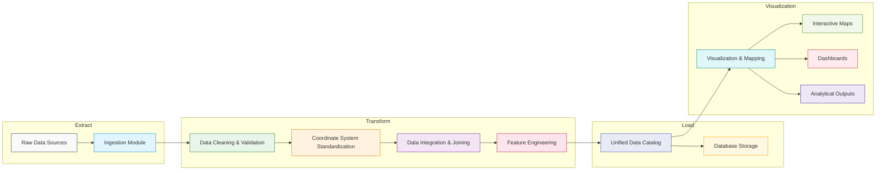
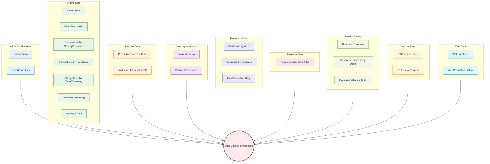
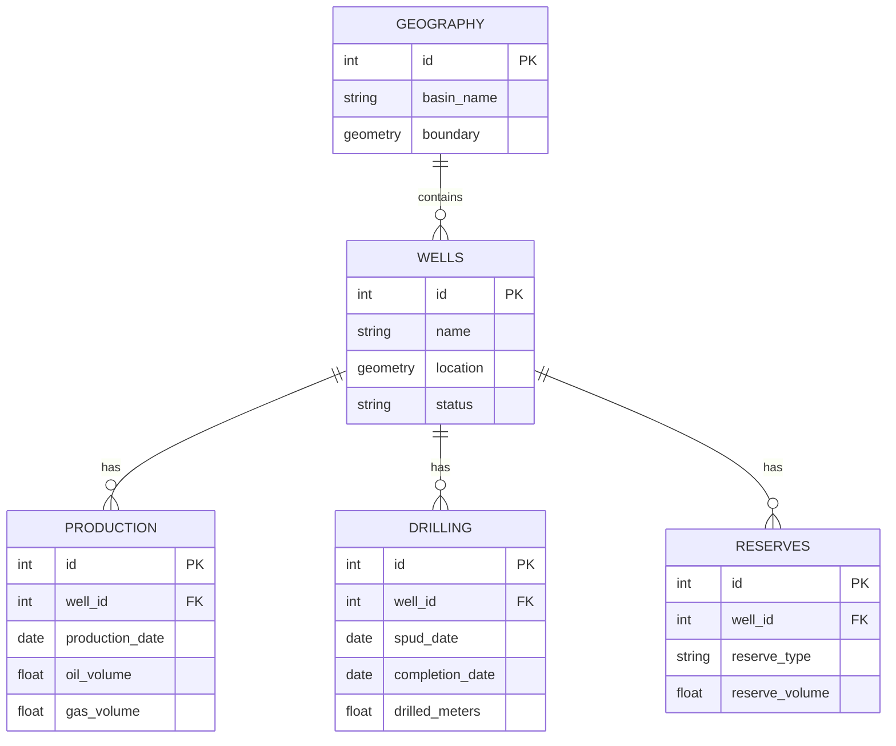

# Oilfield Data Management System

This project is designed to track and analyze oilfield operations by integrating diverse datasets—from well production and drilling records to GIS and seismic data. The goal is to enable informed decision-making for both operational management and strategic planning, ensuring a comprehensive view of oilfield performance and asset status.

## Workflow & Data Pipeline

The data pipeline consists of several stages that convert raw data into actionable insights:



1. **Data Ingestion & Preprocessing**

   - **Data Conversion:** CSV files are converted into GeoDataFrames.
   - **Spatial Standardization:** All layers are reprojected to a common coordinate system (EPSG:4326/3857) to ensure consistency.
   - **Data Cleaning:** Null values, duplicates, and outliers are removed or corrected.

2. **Database Design & Storage**

   - **Normalization:** Data is normalized into dedicated tables for wells, production, drilling, and reserves.
   - **Spatial Databases:** Geospatial data is stored in **PostGIS** or using **GeoParquet** for efficient spatial queries.

3. **ETL & Workflow Automation**

   - **ETL Frameworks:** Tools like **Apache Airflow** or **Prefect** schedule and monitor data ingestion, transformation, and syncing with field reports or partner APIs.
   - **Versioning:** Large datasets are versioned with **DVC** or **Git LFS**.

4. **Visualization & Mapping**
   - **Mapping:** Maps are created using **GeoPandas**, **Folium**, or **Leaflet** to visualize well statuses, drilling evolution, production heat maps, and reserve distributions.
   - **Interactive Dashboards:** Interactive visualizations are built with **Plotly**, **Bokeh**, or web frameworks like **Dash** and **Streamlit**.

## **Data Manifest**

#### **Geographical Data**

| ID                   | Dataset Name       | Description                                  | Format    | Path                                                                       | Status    |
| -------------------- | ------------------ | -------------------------------------------- | --------- | -------------------------------------------------------------------------- | --------- |
| `sedimentary_basins` | Sedimentary Basins | Sedimentary basin polygons                   | Shapefile | `data/raw/geographical/sedimentary-basins/geo-sedimentary-basins.shp`      | Collected |
| `basin_metadata`     | Basin Metadata     | Attributes describing each sedimentary basin | CSV       | `data/raw/geographical/basin-metadata/geo-sedimentary-basins-metadata.csv` | Collected |

#### **Administrative Data**

| ID                  | Dataset Name      | Description                                        | Format    | Path                                                                      | Status    |
| ------------------- | ----------------- | -------------------------------------------------- | --------- | ------------------------------------------------------------------------- | --------- |
| `exploitation_lots` | Exploitation Lots | Boundaries of exploitation areas                   | CSV       | `data/raw/administrative/exploitation-lots/admin-exploitation-blocks.csv` | Collected |
| `concessions`       | Concessions       | Legal exploitation concessions                     | Shapefile | `data/raw/administrative/concessions/admin-exploitation-concessions.shp`  | Collected |
| `satellite_rasters` | Raster Basemaps   | Contextual vector data (terrain, boundaries, etc.) | Shapefile | `data/raw/basemap/raster-basemaps/` (directory not yet populated)         | Optional  |

#### **Well Data**

| ID                | Dataset Name          | Description                                    | Format    | Path                                                           | Status    |
| ----------------- | --------------------- | ---------------------------------------------- | --------- | -------------------------------------------------------------- | --------- |
| `well_shapefile`  | Well Locations        | All wells incl. location, type, company, depth | Shapefile | `data/raw/well/locations/well-locations.shp`                   | Collected |
| `well_status_log` | Well Status Over Time | Operational status per well over time          | CSV       | `data/raw/well/production-history/well-production-history.csv` | Collected |

#### **Reservoir Data**

| ID                     | Dataset Name             | Description                                       | Format    | Path                                                                     | Status    |
| ---------------------- | ------------------------ | ------------------------------------------------- | --------- | ------------------------------------------------------------------------ | --------- |
| `reservoirs`           | Reservoirs               | Hydrocarbon reservoir polygons with operator info | Shapefile | `data/raw/reservoir/locations/reservoir-locations.shp`                   | Collected |
| `reservoirs_avg_depth` | Reservoirs by Avg. Depth | Reservoirs categorized by average depth           | Shapefile | `data/raw/reservoir/locations-by-depth/reservoir-locations-by-depth.shp` | Collected |
| `reserves_volumes`     | Oil & Gas Reserves       | Proven/probable reserve volumes                   | JSON      | `data/raw/reservoir/reserves/reserves-metadata.json`                     | Collected |

#### **Drilling Data**

| ID                            | Dataset Name                 | Description                                          | Format | Path                                                                                                               | Status    |
| ----------------------------- | ---------------------------- | ---------------------------------------------------- | ------ | ------------------------------------------------------------------------------------------------------------------ | --------- |
| `drilled_meters_by_company`   | Drilling Meterage (Company)  | Meters drilled per company/month/concept (2009–2025) | CSV    | `data/raw/drilling/meterage-by-company/drilling-meters-by-company.csv`                                             | Collected |
| `drilled_meters_before_2009`  | Drilling Meterage (Pre-2009) | Historic drilled meters by company and concept       | CSV    | `data/raw/drilling/meterage-pre-2009/drilling-meters-1900-2009.csv`                                                | Collected |
| `wells_in_drilling`           | Active Drilling Wells        | Active drilling wells by company/month               | CSV    | `data/raw/drilling/active-wells/drilling-active-wells.csv`                                                         | Collected |
| `completed_wells`             | Completed Wells              | Completions with company, concept, location          | CSV    | `data/raw/drilling/completed-wells/drilling-completed-wells.csv`                                                   | Collected |
| `wells_completed_by_type`     | Completions by Type/Company  | Well completions by type and company                 | CSV    | `data/raw/drilling/completions-by-type-company/drilling-completed-wells-by-type-and-company.csv`                   | Collected |
| `wells_completed_by_concept`  | Completions by Concept/Prov. | Well completions by concept and province             | CSV    | `data/raw/drilling/completions-by-concept-province/drilling-completed-wells-by-concept-and-province-2009-2025.csv` | Collected |
| `wells_completed_by_welltype` | Completions by Type/Basin    | Well completions by type and basin                   | CSV    | `data/raw/drilling/completions-by-type-basin/drilling-completed-wells-by-type-and-basin.csv`                       | Collected |
| `fracture_data`               | Hydraulic Fracturing         | Hydraulic fracturing registry (Annex IV)             | CSV    | `data/raw/drilling/hydraulic-fracturing/well-fracture-data.csv`                                                    | Collected |

#### **Production Data**

| ID                        | Dataset Name                     | Description                               | Format | Path                                                                               | Status    |
| ------------------------- | -------------------------------- | ----------------------------------------- | ------ | ---------------------------------------------------------------------------------- | --------- |
| `production_by_reservoir` | Production by Reservoir          | Oil production volumes by reservoir       | CSV    | `data/raw/production/by-reservoir/production-oil-by-reservoir.csv`                 | Collected |
| `production_by_area`      | Production by Area & Consortium  | Oil production by area and consortium     | CSV    | `data/raw/production/by-area-consortium/production-oil-by-area-and-consortium.csv` | Collected |
| `gas_production_daily`    | Daily Gas Production by Province | Gas production daily averages by province | CSV    | `data/raw/production/gas-daily-by-province/production-gas-daily-by-province.csv`   | Collected |

#### **Forecast Data**

| ID                         | Dataset Name               | Description                      | Format | Path                                                   | Status    |
| -------------------------- | -------------------------- | -------------------------------- | ------ | ------------------------------------------------------ | --------- |
| `production_forecast_csv`  | Production Forecast (CSV)  | Projected oil and gas production | CSV    | `data/raw/forecast/csv/production-forecast.csv`        | Collected |
| `production_forecast_xlsx` | Production Forecast (XLSX) | Detailed forecast data for 2024  | XLSX   | `data/raw/forecast/xlsx/production-forecast-2024.xlsx` | Collected |

#### **Seismic Data**

| ID                   | Dataset Name       | Description                         | Format    | Path                                                 | Status    |
| -------------------- | ------------------ | ----------------------------------- | --------- | ---------------------------------------------------- | --------- |
| `2d_seismic_lines`   | 2D Seismic Lines   | Seismic exploration line geometries | Shapefile | `data/raw/seismic/2d-lines/seismic-2d-lines.shp`     | Collected |
| `3d_seismic_surveys` | 3D Seismic Surveys | 3D seismic survey polygons          | Shapefile | `data/raw/seismic/3d-surveys/seismic-3d-surveys.shp` | Collected |

---

## Data Relationships



### Capabilities

- **Comprehensive Asset Monitoring:**  
  Track well statuses, drilling activity, and production trends to optimize operational efficiency.

- **Spatial Analysis & Mapping:**  
  Leverage GIS data to overlay oilfield infrastructure, geological features, and legal boundaries, aiding in asset management and risk assessment.

- **Predictive Analytics & Forecasting:**  
  Integrate production forecasts to support planning, budgeting, and strategic investment decisions.

- **Data Quality & Consistency:**  
  Standardize and clean datasets to maintain high-quality, actionable data.

- **Automation & Scalability:**  
  Employ automated ETL workflows for regular updates, ensuring that the system remains current with operational changes and external inputs.

- **Interactive Visualization:**  
  Enable dynamic mapping and dashboards to support detailed analyses and presentations for internal teams and external stakeholders.

### Data Model Diagram



### Model Details

- **Wells:** Central entity representing each oilfield well with geospatial coordinates and operational status.
- **Production:** Time-series data associated with wells, tracking oil, gas, and water volumes.
- **Drilling:** Records documenting drilling activities, including timelines and meters drilled.
- **Reserves:** Data on proven and probable reserves tied to each well.
- **Geography:** Spatial datasets for basins, concessions, and administrative boundaries providing operational context.

### Visualization Outputs

The system generates several types of visualization outputs:

1. **Well Status Map**

   - Interactive map with wells color-coded by status (active, suspended, abandoned)
   - Filter controls for well type, operator, and time period
   - Pop-up information windows with detailed well information

2. **Production Heat Map**

   - Choropleth visualization of production intensity
   - Temporal slider to view production changes over time
   - Aggregation options by different geographic units

3. **Drilling Activity Evolution**

   - Animated time-series visualization showing drilling progression
   - Company-specific views of drilling activity
   - Comparison of drilling activity by basin or province

4. **Reserve Distribution Map**
   - Choropleth map showing reserve volumes by basin
   - Time series visualization of reserve changes
   - Comparison of different reserve categories (proven, probable, possible)

### Ingestion & Data Processing

A dedicated ingestion module is responsible for:

- **Recursive File Discovery:**  
  Scanning `ArgGIS/data/raw` using Python's `pathlib` and `glob` to list all datasets.
- **Specialized Loaders:**
  - **CSV Loader:** Uses `pandas.read_csv` with robust error handling.
  - **Excel Loader:** Leverages `openpyxl`/`xlrd` with custom header detection and table tidying functions.
  - **Spatial Data Loader:** Uses `geopandas.read_file` for shapefiles and DBF formats.
- **Validation:**  
  Ensures that each dataset meets minimal schema requirements (e.g., required columns, valid geometries).
- **Data Catalog:**  
  Stores each dataset along with its metadata (source path, file type, row/column counts) in a central catalog object, making it accessible for further processing.

After ingestion, the pipeline applies normalization and integration routines:

- **Column & Data Normalization:**  
  Functions standardize all datasets.
- **Unique Identifiers:**  
  Generate or map unique IDs for entities to allow seamless joins between datasets.
- **Schema Unification:**  
  Define a comprehensive schema to integrate all data categories.
- **ETL Workflows:**  
  Use automation tools to schedule data ingestion and transformation jobs.

## Tech Stack & Environment

**Core Technologies:**

- **Python 3.11+**
- **Pandas**, **GeoPandas**, **Shapely**, **Fiona**, **Pyproj**, **openpyxl**
- **Plotly**, **Bokeh**, **Folium/Leaflet**
- **Docker**, **Poetry** (for reproducible environments)
- **DVC/Git LFS** (for versioning large datasets)

**Optional Enhancements:**

- **PostGIS** or **GeoParquet** for spatial database storage
- **Contextily** for ESRI/Mapbox basemaps
- **FastAPI** for RESTful services

## Project Structure Overview

The project is organized into the following main components:

- **ArgGIS Directory:**  
  Contains the core code, backups, logs, metadata, notebooks for EDA and mapping prototypes, and the pipeline scripts for ingestion, transformation, and visualization.

- **Pipeline Module:**  
  Scripts and utilities are divided into submodules for ingestion (`ingest.py`), transformation (`transform/`), and mapping (`mapping/`), ensuring modularity and ease of maintenance.

- **Metadata & Documentation:**  
  Comprehensive documentation and data manifests are maintained within the `metadata` directory for clarity on dataset origins, formats, and transformations.

- **Visualization Outputs:**  
  Maps and interactive visualizations are generated and stored in the `outputs` directory, allowing for straightforward sharing and review.

## Getting Started

### Prerequisites

- Python 3.11 or higher
- Docker (optional, for containerized deployment)
- Git (for version control)

### Installation

1. Clone the repository:

   ```bash
   git clone https://github.com/yourusername/ArgGIS.git
   cd ArgGIS
   ```

2. Set up the environment:

   ```bash
   # Using Poetry
   poetry install

   # Or using pip
   pip install -r requirements.txt
   ```

3. Run the data pipeline:

   ```bash
   python pipeline/run.py
   ```

4. Launch the visualization interface:
   ```bash
   # Command to launch visualization interface
   ```

## License

This project is licensed under the [LICENSE] - see the LICENSE file for details.
