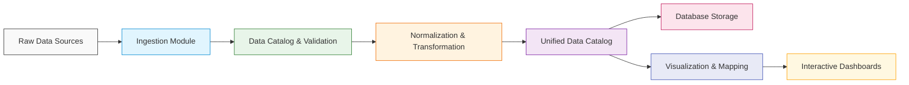
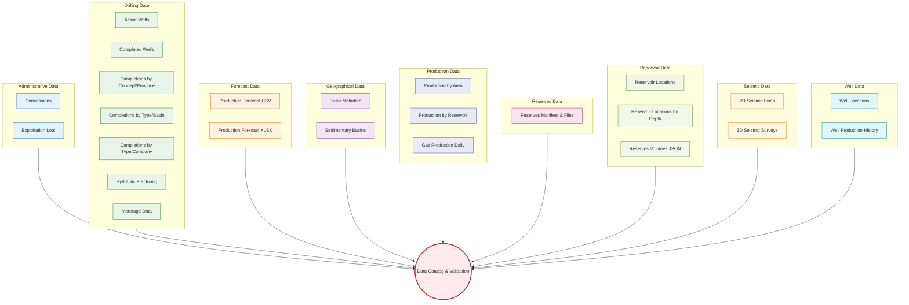

# Oilfield Data Management System

This project is designed to track and analyze oilfield operations by integrating diverse datasets—from well production and drilling records to GIS and seismic data. The goal is to enable informed decision-making for both operational management and strategic planning, ensuring a comprehensive view of oilfield performance and asset status.

---

## Workflow & Data Pipeline

The data pipeline consists of several stages that convert raw data into actionable insights:

1. **Data Ingestion & Preprocessing**

   - **Data Conversion:** CSV files are converted into GeoDataFrames.
   - **Spatial Standardization:** All layers are reprojected to a common coordinate system (EPSG:4326/3857) to ensure consistency.
   - **Data Cleaning:** Null values, duplicates, and outliers are removed or corrected.

2. **Database Design & Storage**

   - **Normalization:** Data is normalized into dedicated tables for wells, production, drilling, and reserves.
   - **Spatial Databases:** Geospatial data is stored in **PostGIS** or using **GeoParquet** for efficient spatial queries.

3. **ETL & Workflow Automation**

   - **ETL Frameworks:** Tools like **Apache Airflow** or **Prefect** schedule and monitor data ingestion, transformation, and syncing with field reports or partner APIs.
   - **Versioning:** Large datasets are versioned with **DVC** or **Git LFS**.

4. **Visualization & Mapping**
   - **Mapping:** Maps are created using **GeoPandas**, **Folium**, or **Leaflet** to visualize well statuses, drilling evolution, production heat maps, and reserve distributions.
   - **Interactive Dashboards:** Interactive visualizations are built with **Plotly**, **Bokeh**, or web frameworks like **Dash** and **Streamlit**.

### Data Pipeline Diagram

```mermaid
flowchart TD
    A[Raw Data Sources]
    B[Data Ingestion]
    C[Data Preprocessing & Cleaning]
    D[Database Storage (PostGIS/GeoParquet)]
    E[ETL Scheduling (Airflow/Prefect)]
    F[Data Transformation]
    G[Visualization & Mapping]
    H[Interactive Dashboards]

    A --> B
    B --> C
    C --> D
    D --> F
    F --> E
    E --> G
    G --> H
```

---

## Dataset Inventory

### Geographical Data

- **Sedimentary Basins**
  - _Description:_ Basin polygons representing sedimentary basins.
  - _Path:_ `data/raw/geographical/sedimentary-basins/geo-sedimentary-basins.shp`
- **Basin Metadata**
  - _Description:_ Attributes describing each basin.
  - _Path:_ `data/raw/geographical/basin-metadata/geo-sedimentary-basins-metadata.csv`

### Administrative Data

- **Exploitation Lots**
  - _Description:_ Boundaries of exploitation areas.
  - _Path:_ `data/raw/administrative/exploitation-lots/admin-exploitation-blocks.csv`
- **Concessions**
  - _Description:_ Legal exploitation concessions boundaries.
  - _Path:_ `data/raw/administrative/concessions/admin-exploitation-concessions.shp`
- **Satellite/Raster Basemaps (Optional)**
  - _Description:_ Contextual vector data including terrain and boundaries.
  - _Path:_ `data/raw/basemap/raster-basemaps/`

### Well Data

- **Well Locations**
  - _Description:_ Location, type, and company details of wells.
  - _Path:_ `data/raw/well/locations/well-locations.shp`
- **Well Production History**
  - _Description:_ Time series of well operational statuses.
  - _Path:_ `data/raw/well/production-history/well-production-history.csv`

### Reservoir Data

- **Reservoir Polygons**
  - _Description:_ Reservoir boundaries with operator details.
  - _Path:_ `data/raw/reservoir/locations/reservoir-locations.shp`
- **Reservoirs by Average Depth**
  - _Description:_ Reservoirs categorized by average depth.
  - _Path:_ `data/raw/reservoir/locations-by-depth/reservoir-locations-by-depth.shp`
- **Reserve Volumes**
  - _Description:_ Proven and probable oil and gas reserves.
  - _Path:_ `data/raw/reservoir/reserves/reserves-metadata.json`

### Drilling Data

- **Drilling Meterage (Company & Pre-2009)**
  - _Description:_ Meters drilled by company for different periods.
  - _Paths:_
    - `data/raw/drilling/meterage-by-company/drilling-meters-by-company.csv`
    - `data/raw/drilling/meterage-pre-2009/drilling-meters-1900-2009.csv`
- **Active and Completed Wells**
  - _Description:_ Active drilling wells and completions details.
  - _Paths:_
    - Active: `data/raw/drilling/active-wells/drilling-active-wells.csv`
    - Completed: `data/raw/drilling/completed-wells/drilling-completed-wells.csv`
- **Completions by Type/Concept/Province**
  - _Description:_ Detailed completion records segmented by type, company, and concept.
  - _Paths:_
    - Type & Company: `data/raw/drilling/completions-by-type-company/drilling-completed-wells-by-type-and-company.csv`
    - Concept & Province: `data/raw/drilling/completions-by-concept-province/drilling-completed-wells-by-concept-and-province-2009-2025.csv`
    - Type & Basin: `data/raw/drilling/completions-by-type-basin/drilling-completed-wells-by-type-and-basin.csv`
- **Hydraulic Fracturing Data**
  - _Description:_ Registry for hydraulic fracturing activities.
  - _Path:_ `data/raw/drilling/hydraulic-fracturing/well-fracture-data.csv`

### Production Data

- **Production by Reservoir & Area**
  - _Description:_ Oil production volumes by reservoir and by area/consortium.
  - _Paths:_
    - Reservoir: `data/raw/production/by-reservoir/production-oil-by-reservoir.csv`
    - Area: `data/raw/production/by-area-consortium/production-oil-by-area-and-consortium.csv`
- **Daily Gas Production**
  - _Description:_ Gas production figures by province.
  - _Path:_ `data/raw/production/gas-daily-by-province/production-gas-daily-by-province.csv`

### Forecast Data

- **Production Forecast**
  - _Description:_ Projected oil and gas production data.
  - _Paths:_
    - CSV: `data/raw/forecast/csv/production-forecast.csv`
    - XLSX: `data/raw/forecast/xlsx/production-forecast-2024.xlsx`

### Seismic Data

- **2D Seismic Lines**
  - _Description:_ Seismic exploration line geometries.
  - _Path:_ `data/raw/seismic/2d-lines/seismic-2d-lines.shp`
- **3D Seismic Surveys**
  - _Description:_ Polygons from 3D seismic surveys.
  - _Path:_ `data/raw/seismic/3d-surveys/seismic-3d-surveys.shp`

---

## Capabilities & High-Level Objectives

- **Comprehensive Asset Monitoring:**  
  Track well statuses, drilling activity, and production trends to optimize operational efficiency.

- **Spatial Analysis & Mapping:**  
  Leverage GIS data to overlay oilfield infrastructure, geological features, and legal boundaries, aiding in asset management and risk assessment.

- **Predictive Analytics & Forecasting:**  
  Integrate production forecasts to support planning, budgeting, and strategic investment decisions.

- **Data Quality & Consistency:**  
  Standardize and clean datasets to maintain high-quality, actionable data.

- **Automation & Scalability:**  
  Employ automated ETL workflows for regular updates, ensuring that the system remains current with operational changes and external inputs.

- **Interactive Visualization:**  
  Enable dynamic mapping and dashboards to support detailed analyses and presentations for internal teams and external stakeholders.

---

## Project Structure Overview

The project is organized into the following main components:

- **ArgGIS Directory:**  
  Contains the core code, backups, logs, metadata, notebooks for EDA and mapping prototypes, and the pipeline scripts for ingestion, transformation, and visualization.

- **Pipeline Module:**  
  Scripts and utilities are divided into submodules for ingestion (`ingest.py`), transformation (`transform/`), and mapping (`mapping/`), ensuring modularity and ease of maintenance.

- **Metadata & Documentation:**  
  Comprehensive documentation and data manifests are maintained within the `metadata` directory for clarity on dataset origins, formats, and transformations.

- **Visualization Outputs:**  
  Maps and interactive visualizations are generated and stored in the `outputs` directory, allowing for straightforward sharing and review.

# ArgGIS Data Pipeline & Workflow

This document describes the overall workflow, data pipeline concepts, and dataset integration for the ArgGIS project. The project ingests, normalizes, integrates, and visualizes diverse geospatial and production datasets for hydrocarbon exploration and production. It is designed to support detailed mapping (well status, drilling evolution, production, reserves) and advanced spatial analytics.

---

## Table of Contents

- [Oilfield Data Management System](#oilfield-data-management-system)
  - [Workflow \& Data Pipeline](#workflow--data-pipeline)
    - [Data Pipeline Diagram](#data-pipeline-diagram)
  - [Dataset Inventory](#dataset-inventory)
    - [Geographical Data](#geographical-data)
    - [Administrative Data](#administrative-data)
    - [Well Data](#well-data)
    - [Reservoir Data](#reservoir-data)
    - [Drilling Data](#drilling-data)
    - [Production Data](#production-data)
    - [Forecast Data](#forecast-data)
    - [Seismic Data](#seismic-data)
  - [Capabilities \& High-Level Objectives](#capabilities--high-level-objectives)
  - [Project Structure Overview](#project-structure-overview)
- [ArgGIS Data Pipeline \& Workflow](#arggis-data-pipeline--workflow)
  - [Table of Contents](#table-of-contents)
  - [Project Overview](#project-overview)
  - [Workflow \& Data Pipeline](#workflow--data-pipeline-1)
    - [Pipeline Diagram](#pipeline-diagram)
  - [Data Inventory](#data-inventory)
    - [Administrative Data](#administrative-data-1)
    - [Drilling Data](#drilling-data-1)
    - [Forecast Data](#forecast-data-1)
    - [Geographical Data](#geographical-data-1)
    - [Production Data](#production-data-1)
    - [Reserves Data](#reserves-data)
    - [Reservoir Data](#reservoir-data-1)
    - [Seismic Data](#seismic-data-1)
    - [Well Data](#well-data-1)
  - [Ingestion \& Cataloging](#ingestion--cataloging)
  - [Data Transformation \& Integration](#data-transformation--integration)
  - [Visualization \& Mapping](#visualization--mapping)
  - [Tech Stack \& Environment](#tech-stack--environment)
  - [Interactive Exploration](#interactive-exploration)
  - [Diagrams](#diagrams)
    - [Overall Pipeline Diagram](#overall-pipeline-diagram)
    - [Dataset Mapping Diagram](#dataset-mapping-diagram)

---

## Project Overview

The ArgGIS project provides an end-to-end solution for:

- **Data Ingestion:** Scanning raw data directories, loading multiple formats (CSV, Excel, Shapefile, DBF, JSON), and validating content.
- **Normalization & Transformation:** Standardizing column names, data types, and unique identifiers across datasets.
- **Data Integration:** Combining and cataloging disparate data sources into a unified schema.
- **Visualization & Mapping:** Generating interactive maps and dashboards for well status, production, drilling evolution, and reserves.
- **Analytics & Reporting:** Producing summaries and detailed reports to support decision making.

---

## Workflow & Data Pipeline

The overall workflow is divided into several stages:

1. **Ingestion & Data Inventory**  
   – Recursively scan raw data directories and load datasets using specialized loaders.

2. **Data Normalization & Transformation**  
   – Clean and standardize column names, convert data types, and create unique IDs.

3. **Data Cataloging & Integration**  
   – Store validated datasets in a central catalog object; integrate related data to form a unified schema.

4. **Database Storage (Optional)**  
   – Store spatial data in PostGIS or GeoParquet for robust querying.

5. **Visualization & Mapping**  
   – Generate interactive maps and dashboards to visualize well status, production, drilling activity, and reserves.

6. **Analytics & Reporting**  
   – Produce detailed reports, interactive visualizations, and ER diagrams to map data relationships.

---

### Pipeline Diagram



---

## Data Inventory

The project manages data across multiple domains. Below is an overview of each category and its contents:

### Administrative Data

- **Concessions**
  - _Description:_ Legal exploitation concessions
  - _Format:_ Shapefile (DBF, PRJ, SHP, SHX)
  - _Path:_ `data/raw/administrative/concessions/`
- **Exploitation Lots**
  - _Description:_ Boundaries of exploitation areas
  - _Format:_ CSV
  - _Path:_ `data/raw/administrative/exploitation-lots/`

### Drilling Data

- **Active Wells**
  - _Format:_ CSV
  - _Path:_ `data/raw/drilling/active-wells/`
- **Completed Wells**
  - _Format:_ CSV
  - _Path:_ `data/raw/drilling/completed-wells/`
- **Completions by Concept/Province**
  - _Format:_ CSV
  - _Path:_ `data/raw/drilling/completions-by-concept-province/`
- **Completions by Type/Basin**
  - _Format:_ CSV
  - _Path:_ `data/raw/drilling/completions-by-type-basin/`
- **Completions by Type/Company**
  - _Format:_ CSV
  - _Path:_ `data/raw/drilling/completions-by-type-company/`
- **Hydraulic Fracturing**
  - _Format:_ CSV
  - _Path:_ `data/raw/drilling/hydraulic-fracturing/`
- **Meterage Data**
  - _Drilling Meterage (Company):_ CSV – `data/raw/drilling/meterage-by-company/`
  - _Drilling Meterage (Pre-2009):_ CSV – `data/raw/drilling/meterage-pre-2009/`

### Forecast Data

- **Production Forecast (CSV)**
  - _Format:_ CSV
  - _Path:_ `data/raw/forecast/csv/`
- **Production Forecast (XLSX)**
  - _Format:_ Excel
  - _Path:_ `data/raw/forecast/xlsx/`

### Geographical Data

- **Basin Metadata**
  - _Description:_ Attributes describing sedimentary basins
  - _Format:_ CSV
  - _Path:_ `data/raw/geographical/basin-metadata/`
- **Sedimentary Basins**
  - _Description:_ Basin polygons
  - _Format:_ Shapefile
  - _Path:_ `data/raw/geographical/sedimentary-basins/`

### Production Data

- **Production by Area & Consortium**
  - _Format:_ CSV
  - _Path:_ `data/raw/production/by-area-consortium/`
- **Production by Reservoir**
  - _Format:_ CSV
  - _Path:_ `data/raw/production/by-reservoir/`
- **Daily Gas Production**
  - _Format:_ CSV
  - _Path:_ `data/raw/production/gas-daily-by-province/`

### Reserves Data

- **Reserves Manifest & Files**
  - _Description:_ Reserve volumes (EOC/EOL) across multiple years
  - _Formats:_ XLS/XLSX and CSV manifest
  - _Path:_ `data/raw/reserves/`

### Reservoir Data

- **Reservoir Locations**
  - _Format:_ Shapefile
  - _Path:_ `data/raw/reservoir/locations/`
- **Reservoir Locations by Depth**
  - _Format:_ Shapefile
  - _Path:_ `data/raw/reservoir/locations-by-depth/`
- **Reserves Volumes**
  - _Format:_ JSON
  - _Path:_ `data/raw/reservoir/reserves/`

### Seismic Data

- **2D Seismic Lines**
  - _Format:_ Shapefile
  - _Path:_ `data/raw/seismic/2d-lines/`
- **3D Seismic Surveys**
  - _Format:_ Shapefile
  - _Path:_ `data/raw/seismic/3d-surveys/`

### Well Data

- **Well Locations**
  - _Format:_ Shapefile
  - _Path:_ `data/raw/well/locations/`
- **Well Production History**
  - _Format:_ CSV
  - _Path:_ `data/raw/well/production-history/`

For detailed dataset descriptions and status, please refer to the included data manifest in the `metadata/datasets/` folder.

---

## Ingestion & Cataloging

A dedicated ingestion module (`utils/ingest.py`) is responsible for:

- **Recursive File Discovery:**  
  Scanning `ArgGIS/data/raw` using Python’s `pathlib` and `glob` to list all datasets.
- **Specialized Loaders:**
  - **CSV Loader:** Uses `pandas.read_csv` with robust error handling.
  - **Excel Loader:** Leverages `openpyxl`/`xlrd` with custom header detection and table tidying functions.
  - **Spatial Data Loader:** Uses `geopandas.read_file` for shapefiles and DBF formats.
- **Validation:**  
  Ensures that each dataset meets minimal schema requirements (e.g., required columns, valid geometries).

- **Data Catalog:**  
  Stores each dataset along with its metadata (source path, file type, row/column counts) in a central catalog object, making it accessible for further processing.

---

## Data Transformation & Integration

After ingestion, the pipeline applies normalization and integration routines:

- **Column & Data Normalization:**  
  Functions like `clean_column_names()` and `smart_type_converter()` standardize all datasets.
- **Unique Identifiers:**  
  Generate or map unique IDs for entities to allow seamless joins between datasets (e.g., linking well production history with well locations).
- **Schema Unification:**  
  Define a comprehensive schema to integrate administrative, drilling, forecast, geographical, production, reserves, reservoir, seismic, and well data.
- **ETL Workflows:**  
  Use automation tools (e.g., Apache Airflow or Prefect) to schedule daily/weekly data ingestion and transformation jobs.

---

## Visualization & Mapping

The unified data is then used for interactive mapping and visualization:

- **Well Status Maps:**  
  Visualize well locations and statuses using **GeoPandas** and **Folium/Leaflet**.
- **Production Heat Maps:**  
  Aggregate production data into grids (hexbin or square) and visualize intensities with **Plotly Choropleths** or **Deck.gl**.
- **Drilling Evolution:**  
  Use time sliders or animations (via Plotly or Bokeh) to show drilling activity over time.
- **Reserve Distribution Maps:**  
  Overlay reserves data on basin polygons with graduated symbols or choropleth maps.

Additionally, web dashboards can be built using **Dash**, **Streamlit**, or **Panel** for real-time data exploration.

---

## Tech Stack & Environment

**Core Technologies:**

- **Python 3.11+**
- **Pandas**, **GeoPandas**, **Shapely**, **Fiona**, **Pyproj**, **openpyxl**
- **Plotly**, **Bokeh**, **Folium/Leaflet**
- **Docker**, **Poetry** (for reproducible environments)
- **DVC/Git LFS** (for versioning large datasets)

**Optional Enhancements:**

- **PostGIS** or **GeoParquet** for spatial database storage
- **Contextily** for ESRI/Mapbox basemaps
- **FastAPI** for RESTful services

---

## Interactive Exploration

The `explore.ipynb` notebook provides an interactive environment to:

- Load and profile all ingested datasets.
- Visualize sample records, generate Pandas Profiling or Sweetviz reports.
- Experiment with data joins, schema designs, and transformation routines.
- Document insights and refine the unified data schema before full pipeline deployment.

---

## Diagrams

### Overall Pipeline Diagram


### Dataset Mapping Diagram



---
